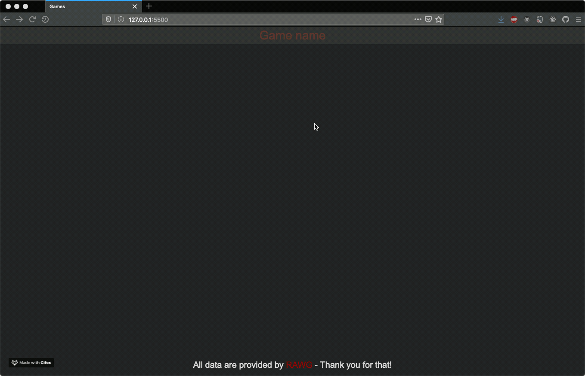

# Gaming Information Homepage

I created this project to review how to work with remote APIs and how to manipulate the content of the DOM. It is build upon knowledge I reviewed during the Quiz App project to further deepen my knowledge. It is done rather quick and dirty as my time frame this sunday was quite small, but I hope to find some time to refactor and clean the code.

The used API is provided by [RAWG](https://rawg.io/) - Thank you guys for that!

# Review the basics Sunday - #RTBS

This is my way of reviewing the basics (more or less) each sunday. In a world filled with NPM packages, ReactJS and all this fancy stuff someone can loose touch with the basic knowledge. At least I'm fearing to do so - so I created this handle #RTBS to create small projects to review the basics. Follow my journey via [Twitter](https://twitter.com/coding_max) and add your own #RTBS story :)

# Preview of this project

