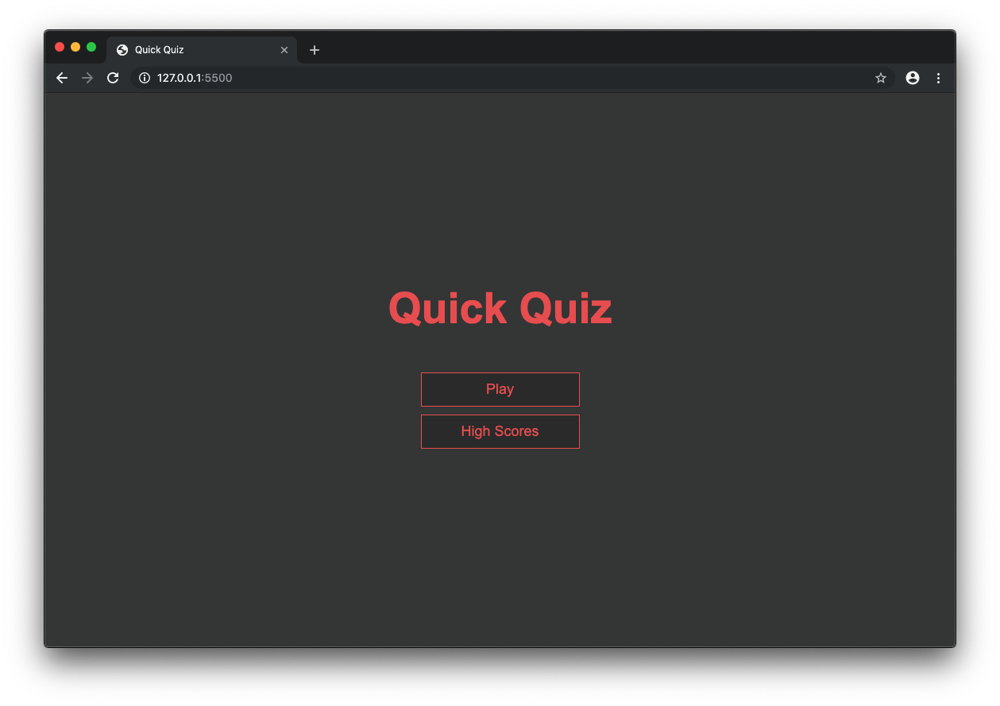
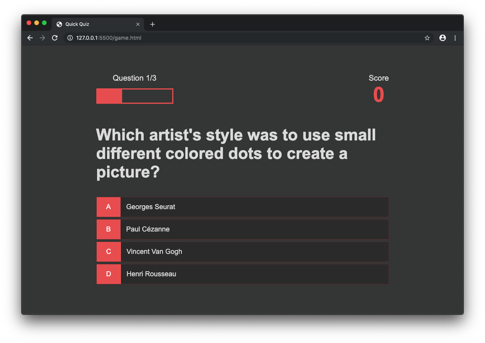

# Quick Quiz App

This project was done with the great course _Build a Quiz App with HTML, CSS and JavaScript_ made by James Quick. You can find his course here: [Udemy](https://www.udemy.com/course/build-a-quiz-app-with-html-css-and-javascript/). It's an awesome way to refresh the webdev basics and the best: **it's free**! You can play around with HTML, CSS and Javascript. And there are awesome take aways in respect to: how to create a pure CSS loading wheel or how to use the local storage and the fetch API. Check it out!

# Review the basics Sunday - #RTBS

This is my way of reviewing the basics (more or less) each sunday. In a world filled with NPM packages, ReactJS and all this fancy stuff someone can loose touch with the basic knowledge. At least I'm fearing to do so - so I created this handle #RTBS to create small projects to review the basics. Follow my journey via [Twitter](https://twitter.com/coding_max) and add your own #RTBS story :)

# Screenshots of this project

